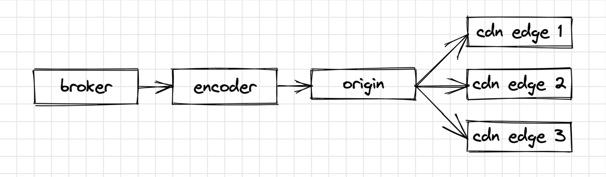

# Video Origin POC
An origin server, sometimes called a CDN origin server, is a computer or service, which is the last point of the network and receives all traffic when a CDN is not used. When CDN is used, an Origin Server serves Edge Server's requests. Edge Servers cache the content from the Origin and handle all incoming requests.  
We use AWS S3 as an Origin Server for video files. The flow is simple, broker sends a video slice(4K) to encoder. Encoder transcodes the source slice to a set of slices that have different resolutions (4K, FHD, HD, SD)
<table width="720px">
  <tr>
    <td></td>
  </tr>
  <tr><td align="center">Transcoding Flow</td></tr>
</table>  

## Problem Statement
Essentially, encoders perform two operations: transcoding and uploading to S3. The problem is that
uploading takes up to 50% (4 sec) of encoders time. Encoders run on accelerated-computing machines (GPU). These 
instances are expensive. Waiting for 4sec for IO is wasteful on such expensive machines.  

## Fact and Observations
| Fact / Observation                                             | Accuracy      | 
|----------------------------------------------------------------|:-------------:|
| The avg transcoding time is 4 sec                              | 80%           |
| The avg uploading time is 4 sec                                | 80%           |
| Each transcoded slice is sent to multiple S3 buckets           | 80%           |
| The storage waste is up to 100%                                | 50%           |

## Solution

### Idea
The idea is to separate IO and Compute Intensive tasks and achieve above 80% of utilization of GPU machines.
Specifically, we can deploy the uploading part of the encoder as Flask Application, and run it on a Network Optimized Machines.  

### How to test
Use Locust to test